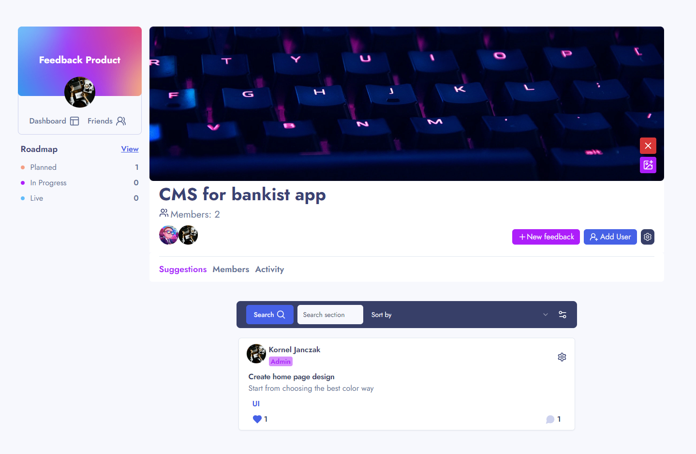

# Fullstack Feedback Product app: Next.js 14, TS, Prisma, PostgreSQL, Tailwind, ShadcnUI 

## Test Account
- Email: test@test.com
- Password: Kw1234!

Key Features 🔑:
- Next Auth by credentials, github
- Friend request send, cancel
- Friend add, delete
- Public profile create
- Public profile background image add, update, delete
- Avatar image add, update, delete
- Manage account data (firstname, lastname, username, email)
- Manage profile data (company, prefer role, location, github link)
- Feedback section create, leave from this, (admin: delete, update section image)
- Feedback section activity log
- Feedback section add friends (admin: give admin, kick member)
- Feebacks roadmap view 
- Feedback create, delete, update
- Comment create, delete, 
- Comment replies create, delete
- Modern ui with shadcn UI
- Responsive design
- 100% written in TS

## Built with 🛠

Tools 
---|  
Server actions |
Next safe action |
Zod | 
Zustand | 
Uploadthing | 
Use hooks | 
Sonner | 

<h2>What I've learned? 📗</h2>

- Deepended my knowladge in Tailwind, Prisma, Server Actions
- Use zod with server actions and react hook form
- Upload image by uploadthing and AWS bucket (it was my first approach, but i switched to uploadthing)

<h2>What next?</h2>

- In meantime I'll add notifications fc.

Part of design is from <a href="https://www.frontendmentor.io/challenges/product-feedback-app-wbvUYqjR6" target="_blank">Frontend mentor</a>

  
